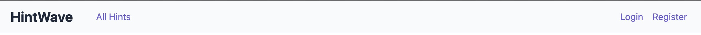

# HintWave - Produktová Dokumentace
Aplikace HintWave funguje jako platforma pro sdílení a správu uživatelských tipů (hintů). Každý hint obsahuje název, popis a sadu důvodů/vysvětlení. Hinty jsou organizovány do kategorií pro lepší přehlednost.

### Navigace
1. Nepřihlášený uživatel

2. Přihlášený uživatel

3. Přihlášený admin

#### Navigace odkazuje na jednotlivé stránky
1. **All hints** - Stránka, kde jsou úplně všechny doporučení seřazeny od nejnovějšího
2. **Recommended** - Stránka, kde jsou doporučené hinty k jednotlivým kategoriím
3. **Add hint** - Stránka, kde se dá vytvořit nový hint
4. **Manage users** - Stránka, kde se admin může jednotlivé uživatele mazat nebo povýšit/degradovat na admin/běžného uživatele
5. **Logout** - Tlačítko, jak se uživatel může odhlásit
6. **Login** - Stránka, kde se uživatel může přihlásit
7. **Register** - Stránka, kde se uživatel může registrovat

### Hint komponenta

- **Name** - Název hintu
- **Description** - Popis hintu
- **Category** - Kategorie hintu
- **Created at** - Datum vytvoření hintu
- **Created by** - Uživatel, kdo hint vytvořil
- **Reasons** - Důvody/vysvětlení hintu

### Stránky
1. **All hints**

- Hinty od nejnovějšího, po kliknutí na hint se zobrazí detail
- Stránkování po 4 hintech na stránku
- Číslo stránky je v URL parametru "page"

2. **Recommended**

- Hinty doporučené k jednotlivým kategoriím, opět po kliknutí na hint se zobrazí detail

3. **Add hint**

- Stránka pro vytvoření nového hintu, po vyplnění formuláře se hint vytvoří
- Formulář je validován na backendu i frontendu:
  - Titulek: 1-256 znaků
  - Popis: 1-1024 znaků
  - Kategorie: musí být validní ID existující kategorie
  - Důvody: 2-12 důvodů, každý 3-64 znaků
- Po editaci se uživatel automaticky přesměruje na detail upraveného hintu
- Pouze přihlášení uživatelé mohou vytvářet a editovat hinty
- Editovat hint může pouze jeho autor nebo admin
- Dynamické přidávání/odebírání důvodů
- Chybové zprávy se zobrazují pod jednotlivými poli
- Při editaci jsou předvyplněná původní data hintu

4. **Manage users**

- Pouze admin má přístup k této stránce
- Pro každého uživatele se zobrazuje:
  - Profilový obrázek (defaultní nebo vlastní)
  - Uživatelské jméno
  - Datum registrace
  - Role (admin/user)
  - Tlačítko pro smazání (kromě vlastního účtu)
- Možnosti správy:
  - Změna role uživatele (povýšení/degradace admin/user)
  - Admin nemůže změnit svoji vlastní roli
  - Smazání uživatele (kromě vlastního účtu)
- Zabezpečení:
  - Ověření admin role pro přístup
  - Ověření admin role pro všechny akce

5. **Login**

- Stránka pro přihlášení uživatele
- Formulář obsahuje:
  - Uživatelské jméno
  - Heslo
- Chybové zprávy:
  - Zobrazují se pod formulářem
  - Obecná chybová hláška při neplatném přihlášení
- Po úspěšném přihlášení:
  - Vytvoření session
  - Uložení informací o uživateli
  - Přesměrování na hlavní stránku

6. **Register**

- Stránka pro registraci nového uživatele
- Formulář obsahuje:
  - Uživatelské jméno (3-35 znaků)
  - Heslo (min. 8 znaků, musí obsahovat velké písmeno, malé písmeno, číslo a speciální znak)
  - Potvrzení hesla (musí se shodovat s heslem)
  - Datum narození (uživatel musí být starší 13 let)
  - Volitelný profilový obrázek
    - Podporované formáty: JPEG, PNG, WebP
    - Maximální velikost 5MB
    - Drag & drop nebo výběr souboru
    - Náhled vybraného obrázku
- Validace:
  - Kontrola unikátnosti uživatelského jména
  - Kontrola věku uživatele (min. 13 let)
  - Validace formátu a velikosti obrázku
- Chybové zprávy:
  - Zobrazují se pod jednotlivými poli
  - Detailní popis chyby pro každé pole
- Po úspěšné registraci:
  - Automatické přihlášení
  - Zpracování a uložení profilového obrázku
  - Přesměrování na hlavní stránku

7. **Hint detail**

- Stránka zobrazující detail konkrétního hintu
- Zobrazované informace:
  - Nadpis hintu
  - Kategorie (badge)
  - Metadata:
    - Autor hintu (uživatelské jméno)
    - Datum vytvoření
  - Popis hintu
  - Seznam důvodů:
- Navigace:
  - Tlačítko pro návrat na seznam hintů
  - Validace existence hintu (přesměrování na index.php při neexistujícím ID)
